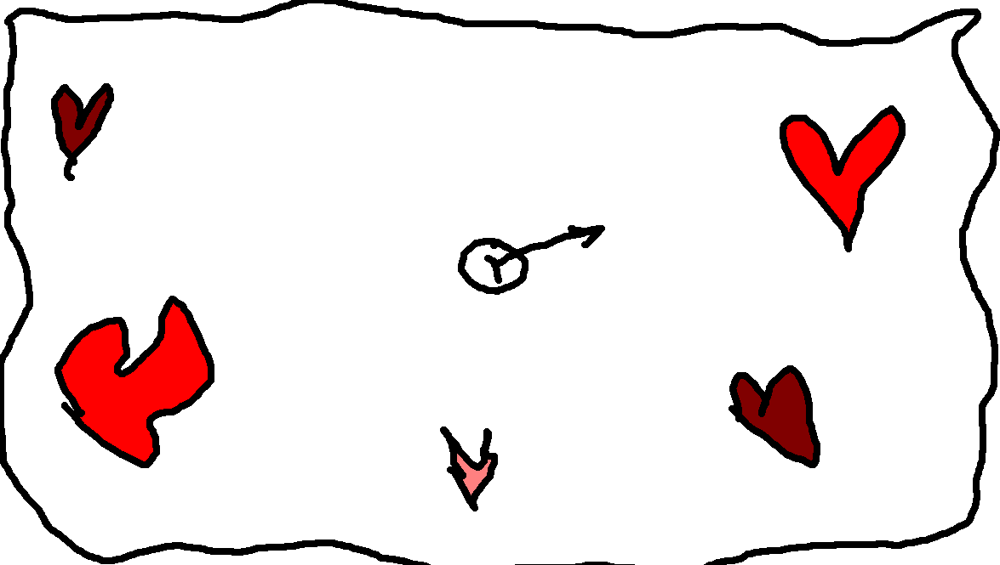

# sfml-heart

[sfml-heart](https://github.com/maidis/sfml-heart) is SFML port of [Valentine's Day heart shape from Solarian Programmer](https://solarianprogrammer.com/2019/02/14/cpp-17-draw-valentine-day-heart-shape/).


In order to generate the above heart shapes we can use the [parametric form](http://mathworld.wolfram.com/HeartCurve.html) of the outer curve:

```
x(t) = 16sin(t)^3;
y(t) = 13cos(t) − 5cos(2t) − 2cos(3t) − cos(4t);
```

where

```
t ∈ [0, 2π]
```

Using the above equations, we can generate the x, y points of the heart curve. In order to actually draw the points, we use SFML.

`auto [vx, vy] = generate_points(no_pieces);` line uses [structured bindings](https://en.cppreference.com/w/cpp/language/structured_binding) declaration that requires a C++17 compatible compiler. Basically, we use the `vx` and `vy` references as aliases instead of the more clunky `std::tuple` syntax.

`generate_points` function generates the curve points. We’ll divide the `[0, 2π]` interval in equal `2π / no_pieces` pieces.

Once we’ve generated the curve points, we need to flip the Y coordinates because, like most multimedia library, SFML has the Y axis pointing down. We can do this in the main function:

```cpp
// Reverse Y axis direction
std::for_each(std::begin(vy), std::end(vy), [](double &y){ y = -y; });
```

I’ve tested the code with Qt Creator on Fedora 29. With small changes at `CMakeLists.txt` you can run it on Windows and macOS too.

In this demo you have to collect all the hearts to reveal the secret message. Maybe I can turn this demo into a simple game (match the same colored hearts in sequence) later.


